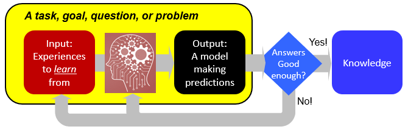
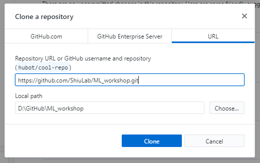

# Machine learning hands-on



## 1. Workshop information

### 1.1 What this is about

More and more data are available in plant science that have fueled ground breaking discoveries. Beyond the original intents of the experiments, these data can be used to discover even more. This is where machine learning comes in. We can use computers to learn from data and generate models that can predict a biological phenomenon of interest - e.g. will this gene be lethal when it is knocked-out, or which genetic variants can meaningfully predict a phenotype of interests. Specifically, this workshop will touch on the following topics: What is machine learning and why is it useful? How does machine learning work? What are some example machine learning applications in plant science? How can we feed data into machine learning tools to make discoveries? What are the best practices when doing machine learning? Where to go to learn more? The workshop will include presentations, discussions, and a short hands-on section using online machine learning resources.

### 1.2 When and where

When and where
- 1-3pm, 4/12/2022
- The NRT IMPACTS Annual Symposium
- [Event link](https://impacts.natsci.msu.edu/2022-annual-symposium/)

### 1.3 Who we are

* Our lab [website](https://shiulab.github.io/)

### 1.4 What kinds of materials we are sharing

- Workshop jupyter notebooks
- An example data to run an ML project based on [this paper](https://pubmed.ncbi.nlm.nih.gov/30674669/).

## 2. Instructions for runnning the notebook

### 2.1 What's needed

The workshop example is provided as a [Jupyter notebook](https://jupyter-notebook-beginner-guide.readthedocs.io/en/latest/what_is_jupyter.html). It is a document generated by the [Jupyter Lab or Jupyter Notebook applications](](https://jupyter.org/install.html)). A notebook can contain both computer codes in popular languages such as Python and R, and texts in the form of paragraph, equations, figures, links, etc.

To follow what we have shown in the workshop, you need the following:
* Git: for you to "clone" this repository to your computer to play with.
* Jupyter Lab: the application to view, edit, and execute codes in the notebook.
* Scikit-Learn and others: the software packages Jupyter Lab relies on to run the codes.

### 2.2 Get the notebook and data

You can download the notebooks and data from this Google Drive folder.

__But, I prefer that you get them by setting up:__
- `git`, a version control software (i.e., a tool to keep track of updates to codes) widely used by folks writing software in any language.
- [Github](https://github.com/) is a code hosting platform that uses `git` for version control and collaboration (i.e., many people can work on the same codes).

If you don't have git and/or Github account, do the following:
1. Create a [GitHub Account](https://github.com/join)
2. Download and install [Github Desktop](https://desktop.github.com/)
  * Or you can use [Git](https://git-scm.com/book/en/v2/Getting-Started-Installing-Git) if you are familar with version control and command-line interface. Note that the following info is for using Github Desktop.
3. Clone the ML_workshop by following [this instruction](https://docs.github.com/en/desktop/contributing-and-collaborating-using-github-desktop/cloning-and-forking-repositories-from-github-desktop) and the following screenshot.
  * __Note:__ You can specify where the repository goes in your computer. We suggest leaving it as default and to remember where it is - we need it later.

4. Navigate to the location where the cloned repository is and confirm that it is there.

### 2.3 Install Anaconda

[Anaconda](https://www.anaconda.com/) is a a free and open-source distribution of the programming languages Python and R and is a widely used platform for computational and data science applications.

1. Download the Python 3.X version of [Anaconda](https://www.anaconda.com/products/individual#Downloads). 
2. Install Anaconda using the [instructions](https://docs.anaconda.com/anaconda/install/).
3. Open your terminal in [Mac](https://support.apple.com/guide/terminal/open-or-quit-terminal-apd5265185d-f365-44cb-8b09-71a064a42125/mac) or [PC](https://www.wikihow.com/Open-Terminal-in-Windows) 
  * __Note__: For PC, you need to open the terminal by "Running as Administrator". If you are not familiar with this, see [this post](https://www.itechtics.com/run-programs-administrator/) for more info.
  
4. Issue the following command to make sure Anaconda installation is complete:
```
conda list
```
The above command allows you to see what software packages have been installed.

### 2.4 Install software packages

[Conda](https://docs.conda.io/en/latest/) is a package/environment management system. It deals with installing software packages in your computer. It also creates and manage virtual environments where each environment you have a specific set of software for a general category of tasks.  

1. Create an `ml_workshop` environment and activate it:
```
conda create -n ml_workshop python=3.10
conda activate ml_workshop
```
* __Note__: When prompted with `Proceed`, type `y`.

2. Install software packages and their dependencies:
```
conda install jupyterlab ipykernel ipywidgets matplotlib nb_conda pandas scikit-learn seaborn shap tqdm

pip install imbalanced-learn
```

### 2.5 Open the notebooks 

1. Run Jupyter Lab

* If you use Linux or Mac OS:

```
jupyter lab
```
* If you use PC, and your Github folder is in __C:/__ drive, then do:
```
jupyter lab --notebook-dir=C:/
```
* If you use PC and your Github folder is in __D:/__ drive, do:
```
jupyter lab --notebook-dir=D:/
```

2. In the Jupyter lab window that opens, on the left panel, navigate to __ML_workshop__, the directory where the cloned Github repository is stored.

3. Open `ML_workshop-part_a-preparation.ipynb`

4. Run each code element by clicking ```SHIFT + ENTER```.

### 2.6 If you have trouble getting Jupyer Lab to run 

Please make sure you:
1. Watch [this video](https://www.youtube.com/watch?v=cfj6yaYE86U), and [this video](https://www.youtube.com/watch?v=-_XYmr4vkwc).
1. Go to have a look at the [pre-workshop notebook through GitHub](https://github.com/ShiuLab/ML_workshop/blob/master/ML_workshop-part_a-preparation.ipynb) and take some notes on the questions asked.

We will continue the rest in the workshop.
